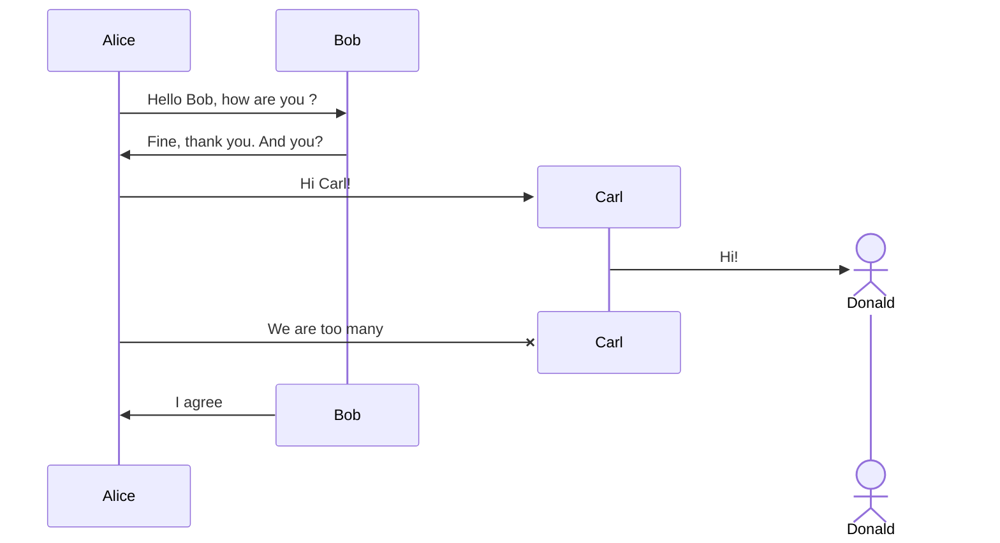
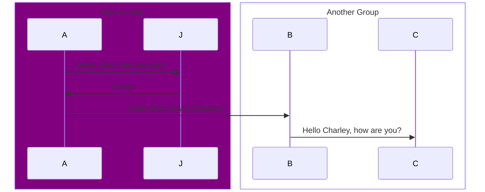
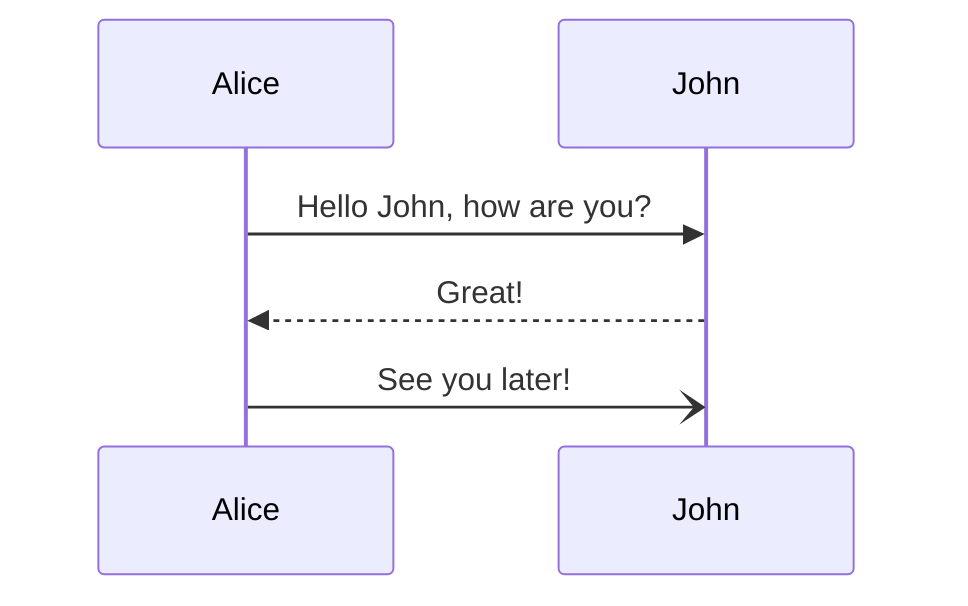
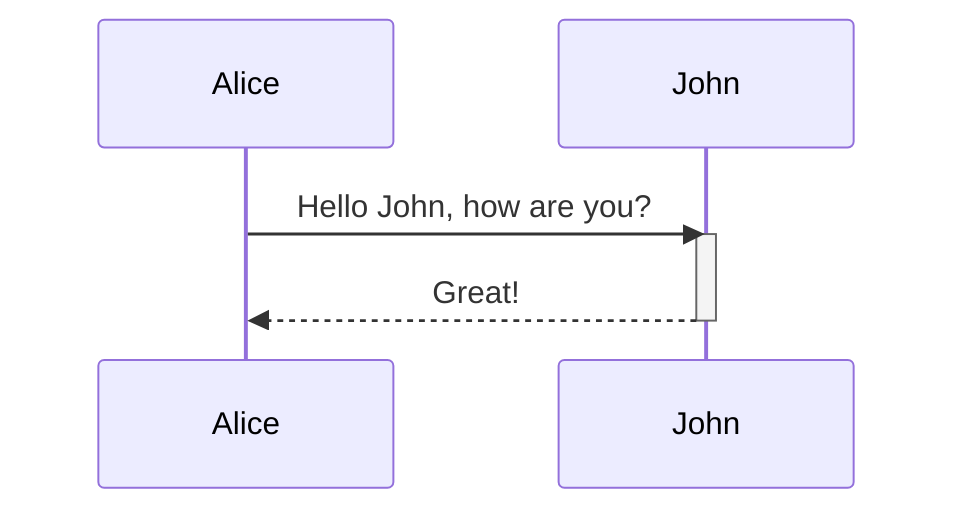
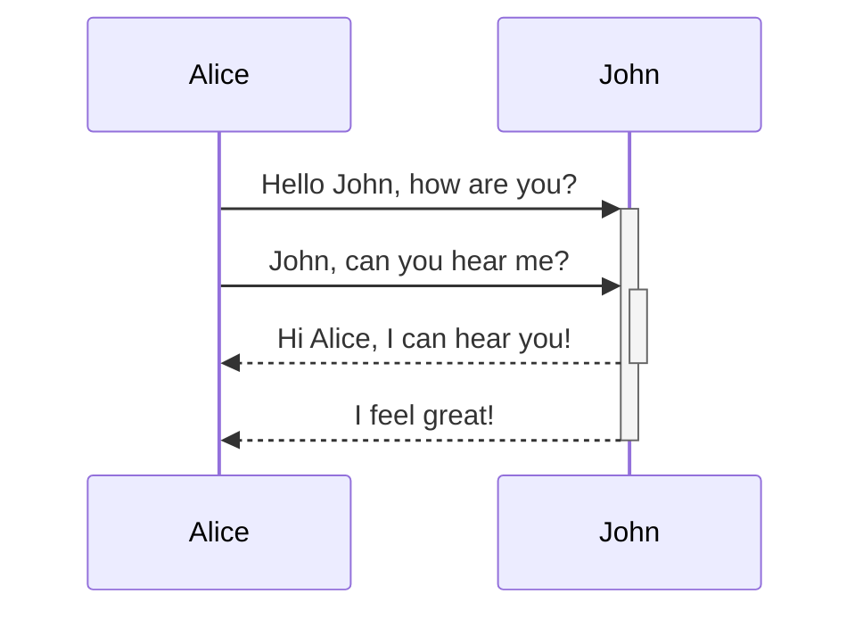
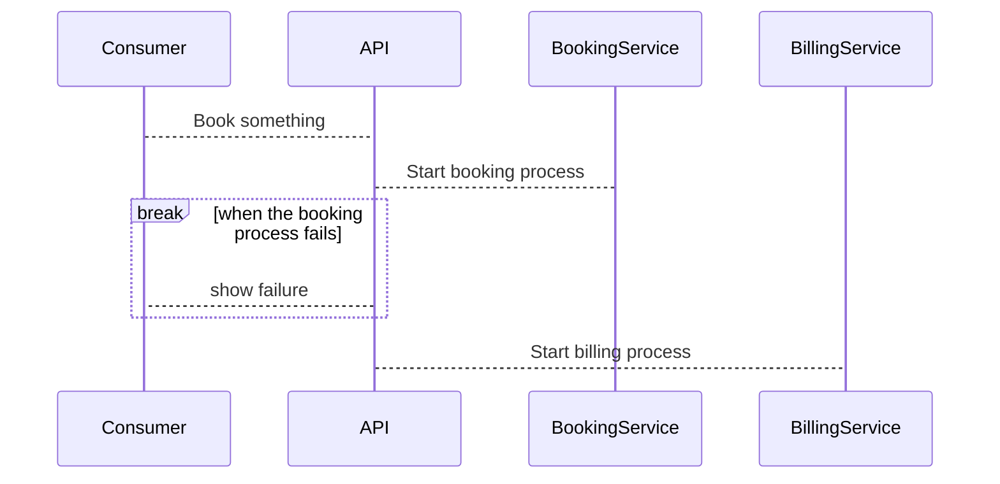
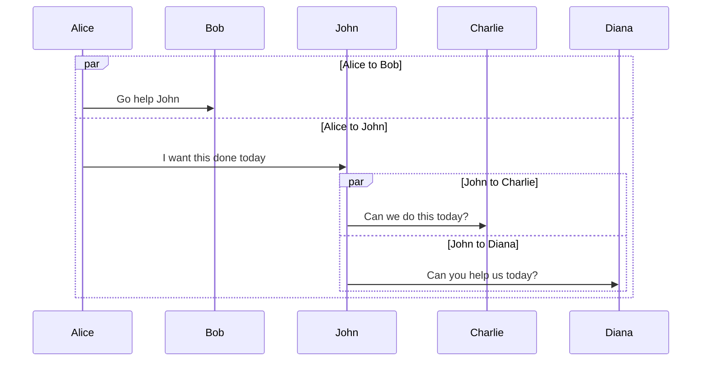
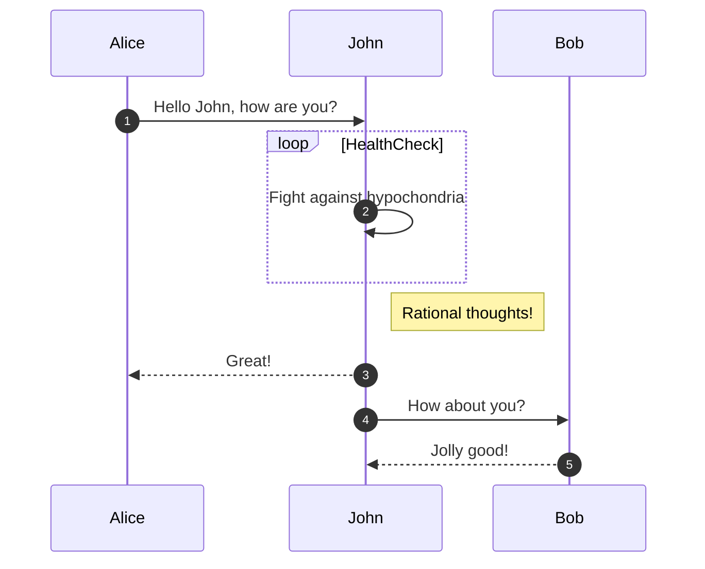
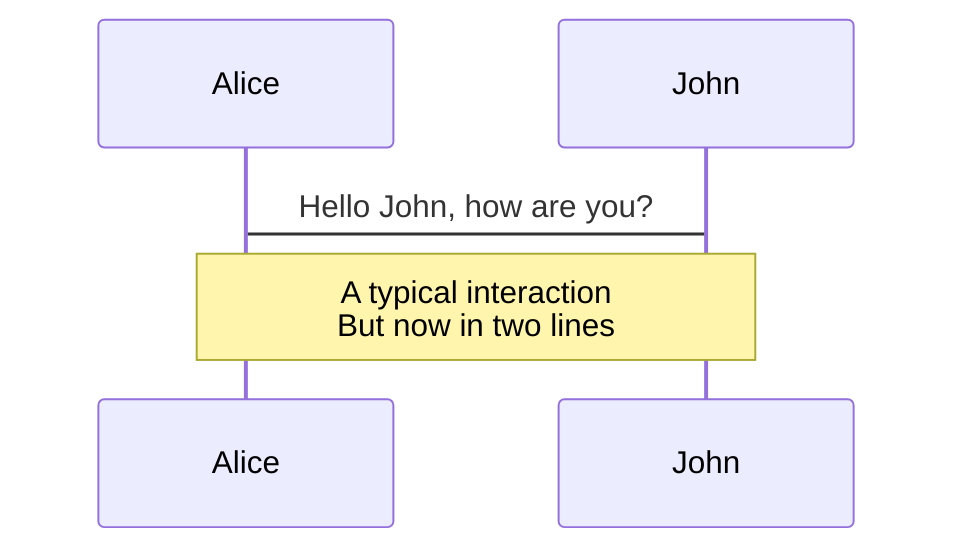
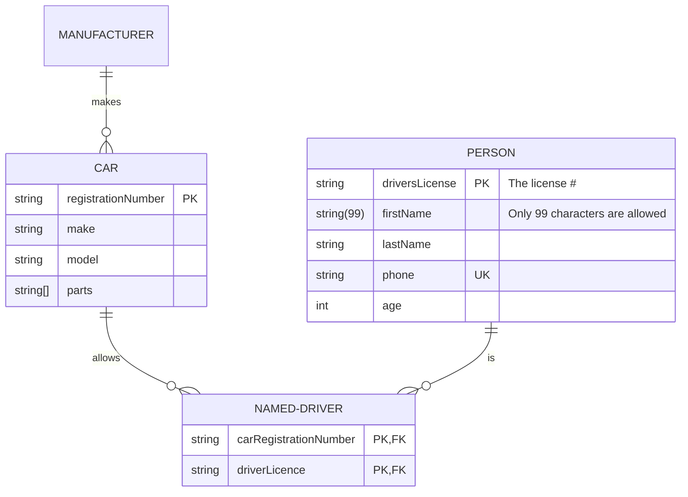

# Mermaid Sample

https://mermaid.js.org/intro/

---

```mermaid
sequenceDiagram
    Alice->>Bob: Hello Bob, how are you ?
    Bob->>Alice: Fine, thank you. And you?
    create participant Carl
    Alice->>Carl: Hi Carl!
    create actor D as Donald
    Carl->>D: Hi!
    destroy Carl
    Alice-xCarl: We are too many
    destroy Bob
    Bob->>Alice: I agree
```

---

```mermaid
    sequenceDiagram
    box Purple Alice & John
    participant A
    participant J
    end
    box Another Group
    participant B
    participant C
    end
    A->>J: Hello John, how are you?
    J->>A: Great!
    A->>B: Hello Bob, how is Charley?
    B->>C: Hello Charley, how are you?

```

---

```mermaid
sequenceDiagram
    Alice->>John: Hello John, how are you?
    John-->>Alice: Great!
    Alice-)John: See you later!
```

---

---

```mermaid
sequenceDiagram
    Alice->>John: Hello John, how are you?
    activate John
    John-->>Alice: Great!
    deactivate John

```

---

---

```mermaid
sequenceDiagram
    Alice->>+John: Hello John, how are you?
    Alice->>+John: John, can you hear me?
    John-->>-Alice: Hi Alice, I can hear you!
    John-->>-Alice: I feel great!
```

---

```mermaid
sequenceDiagram
    Consumer-->API: Book something
    API-->BookingService: Start booking process
    break when the booking process fails
        API-->Consumer: show failure
    end
    API-->BillingService: Start billing process

```

---

```mermaid
sequenceDiagram
    par Alice to Bob
        Alice->>Bob: Go help John
    and Alice to John
        Alice->>John: I want this done today
        par John to Charlie
            John->>Charlie: Can we do this today?
        and John to Diana
            John->>Diana: Can you help us today?
        end
    end
```

---

```mermaid

sequenceDiagram
    autonumber
    Alice->>John: Hello John, how are you?
    loop HealthCheck
        John->>John: Fight against hypochondria
    end
    Note right of John: Rational thoughts!
    John-->>Alice: Great!
    John->>Bob: How about you?
    Bob-->>John: Jolly good!

```

---

```mermaid

sequenceDiagram
    Alice->John: Hello John, how are you?
    Note over Alice,John: A typical interaction<br/>But now in two lines

```

---

```mermaid

erDiagram
    CAR ||--o{ NAMED-DRIVER : allows
    CAR {
        string registrationNumber PK
        string make
        string model
        string[] parts
    }
    PERSON ||--o{ NAMED-DRIVER : is
    PERSON {
        string driversLicense PK "The license #"
        string(99) firstName "Only 99 characters are allowed"
        string lastName
        string phone UK
        int age
    }
    NAMED-DRIVER {
        string carRegistrationNumber PK, FK
        string driverLicence PK, FK
    }
    MANUFACTURER only one to zero or more CAR : makes

```
